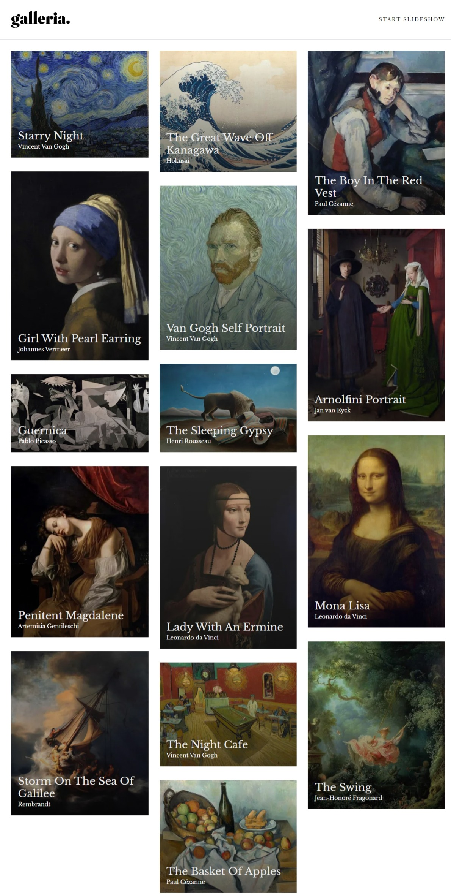

# Galeria - Slideshow gallery with masonery layout

This is a page that showcases sme of the most infleuntial art works in the recent centuries 

## Table of contents

- [Overview](#overview)
  - [The challenge](#the-challenge)
  - [Screenshot](#screenshot)
  - [Links](#links)
- [My process](#my-process)
  - [Built with](#built-with)
  - [What I learned](#what-i-learned)
  - [Continued development](#continued-development)
- [Author](#author)

## Overview

### The challenge

Your users should be able to:

- Navigate the slideshow and view each painting in a lightbox
- View the optimal layout for the app depending on their device's screen size
- See hover states for all interactive elements on the page

### Screenshot

### Links

- Solution URL: [solution URL](https://github.com/Silkiercomet/gallery-slideshow-app)
- Live Site URL: [ live site URL ](https://gallery-slideshow-app.vercel.app/)

## My process

Due to this page's nature of having numerous pages, I decided that the best approach was to use Next.js to dynamically create the routes and their pages on the server because all the pages are static pages their content is informative and doesn't change 

### Built with

- Semantic HTML5 markup
- tailwindcss
- Next.js

### What I learned

This project teached me how to create a Masonery layout, also help to get in touch with the new version of next js, next 14 and the app director, the practice of tailwind was also really nice

### Continued development

We can add some animation that activate if the user has movement active in his browser

## Author

- Website - [Add your name here](https://luis-colina-portfolio.netlify.app/)

